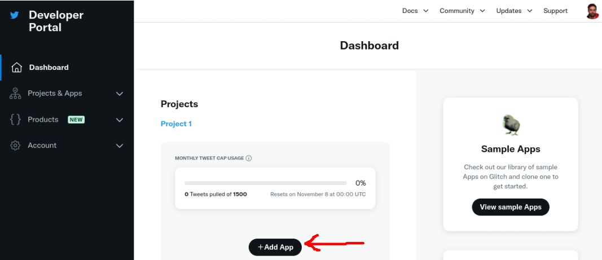
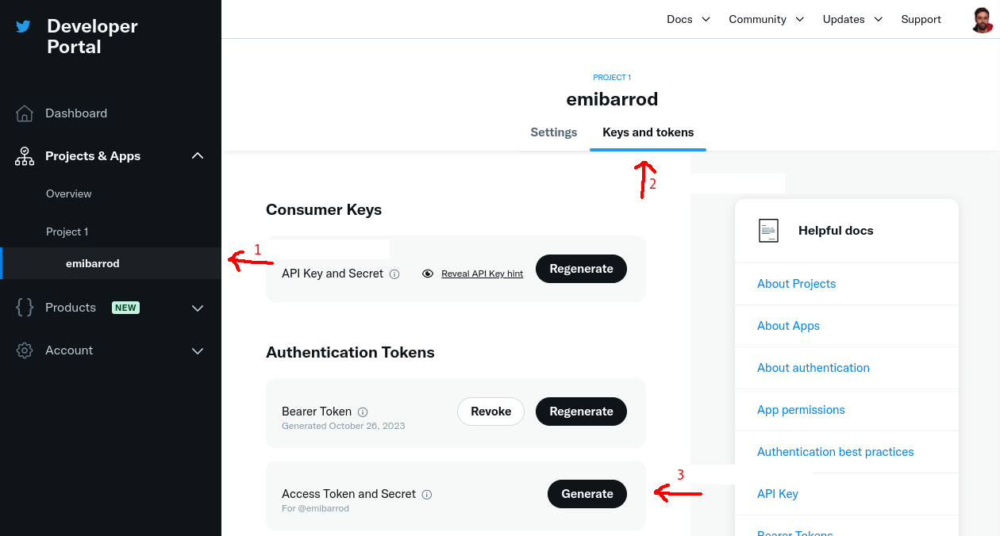
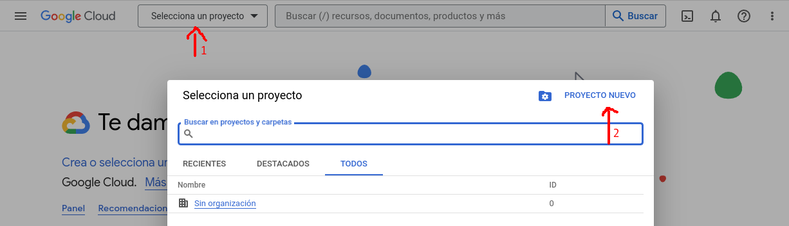
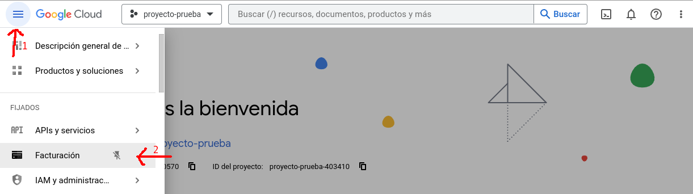
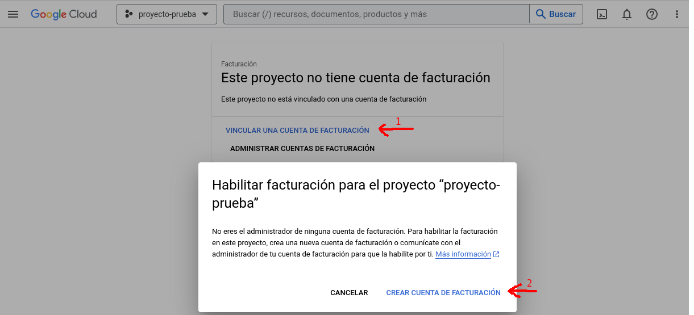

# Cómo crear un bot automatizado de Twitter con GPT, Python y GCP

Te voy a contar cómo hice un bot automatizado de Twitter que crea sus propios tweets usando la API de OpenAI.

## Pasos previos

Antes de empezar necesitamos tres cosas:

- Una cuenta de Twitter Developer
- Una cuenta en la API de OpenAI
- Un proyecto creado en Google Cloud Platform

Vamos a ver cómo conseguimos estas cosas.

> **IMPORTANTE**: Voy a suponer que estás usando Linux para seguir este tutorial. Si usas Windows quema tu ordenador e instala Linux. En su defecto, te recomiendo [WSL2](https://learn.microsoft.com/es-es/windows/wsl/install). También se presupone cierto nivel en programación Python.

### Twitter Developer Account

Para hacerte una cuenta de Twitter Developer y tener acceso a las API de Twitter, haz lo siguiente:

1. **Créate una cuenta de Twitter**: 
    Si aún no tienes una cuenta en Twitter, necesitas crear una. Es recomendable que configures tu cuenta con una foto de perfil, biografía y número de teléfono verificado. Para que Elon Musk vea que eres de fiar.

2. **Regístrate en el Portal de Desarrolladores**:
    Ve a [Twitter Developers](https://developer.twitter.com/) y regístrate. No voy a decirte cómo registrarte porque cambian el proceso cada dos por tres.
    Si tu solicitud es aceptada, recibirás un correo electrónico de confirmación y podrás empezar a usar las herramientas para desarrolladores de Twitter. Si Twitter tiene preguntas adicionales o necesita más información sobre tu solicitud, es posible que te contacten para obtener más detalles.

3. **Configurar tu aplicación**:
    Una vez dentro del portal, puedes crear una App que te proporcionará las claves API y tokens de acceso necesarios para interactuar con la API de Twitter.

    

    > **IMPORTANTE**: Acuérdate de guardar las API Keys que te dan después de crear la App, o las tendrás que reestablecer luego.

    En especial necesitaremos: API Key, API Key Secret, Access Token y Access Token Secret. Estas dos últimas se consiguen yendo al apartado "Keys and tokens" de tu App y generándolas:

    

### OpenAI API

Para crear una cuenta y acceder a la API de OpenAI, sigue los siguientes pasos:

1. **Regístrate en OpenAI**: 
   Dirígete al sitio web oficial de OpenAI para registrarte: [https://platform.openai.com/signup](https://platform.openai.com/signup).

2. **Consigue la API Key**:
   Una vez registrado, ve a [https://platform.openai.com/account/api-keys](https://platform.openai.com/account/api-keys), busca la opción para crear una nueva clave API (API Key). Esta clave te permitirá hacer llamadas a la API de OpenAI desde tu código.

3. **Configura la facturación** (opcional):
    La API de OpenAI te ofrece 5$ de créditos gratis a lo largo de 3 meses. Sin embargo, mi recomendación es que actives la facturación para que cuando se acaben los créditos no tengas problemas. Para ello ve a [https://platform.openai.com/account/billing/payment-methods](https://platform.openai.com/account/billing/payment-methods) y configura un método de pago. Los precios de la API son bastante bajos. Puedes ver los precios en [la página de pricing](https://openai.com/pricing#language-models).

    > **IMPORTANTE**: Te aconsejo que actives un límite de facturación mensual. Puedes hacerlo en el apartado de [Usage Limits](https://platform.openai.com/account/billing/limits). Yo lo tengo puesto a 1$, aunque nunca he gastado más de 4 céntimos mensuales.

### Google Cloud Platform

Para este paso, voy a suponer que tienes una cuenta de Google.

1. **Crea un proyecto en GCP**:
    Ve a Google Cloud ([https://cloud.google.com/](https://cloud.google.com/)) e inicia sesión. Serás dirigido al Console de GCP. En el menú desplegable de la parte superior, crea un nuevo proyecto:

    

    Cuando lo hayas creado, seleccionalo. Debería aparecerte en el desplegable anterior.


2. **Habilitar la facturación**:
    En el panel de navegación izquierdo de de GCP, busca "Facturación". Haz clic en "Vincular una cuenta de facturación" y selecciona la cuenta de facturación que quieras. Si no tienes una, haz clic en "Crear cuenta de facturación" y sigue los pasos. Puede ser que te den una prueba gratis. Acéptala, es gratis.

    

    

## Desarrollo

Vamos a dividir el desarrollo en 3:

- **Código**: Todo el código que pondremos en GCP.
- **Implementación en GCP**: Cómo pasar nuestro código en local a GCP.
- **Ejecución automática**: Cómo automatizar la ejecución diaria de nuestro script en GCP.

### Código

Antes de nada, hay que asegurarse de que tenemos instaladas las dos librerías que usaremos. Para ello:

- `pip install openai`
- `pip install tweepy`

Tras instalar estas dos librerías, estamos listos para empezar a programar.

- **tweet_generation.py**: Este archivo contendrá todo lo necesario para generar el texto que contendrá nuestro tweet.

Primero tenemos que importar las librerías necesarias:

```python
import os
import random
import openai
```

Ahora necesitamos la API Key de OpenAI que obtuviste en el apartado de pasos previos. Una vez que la tengas a mano, añade a tu código lo siguiente:

```python
openai.api_key = "aquí va tu api key"
```

Esta parte es interesante. Tienes que definir qué quieres que escriba tu bot automatizado. En mi caso quiero que pueda hacer 2 cosas: Contar un chiste o una adivinanza. Para ello, escribe un diccionario que contenga los "prompts" (así se llaman las instrucciones que se les manda a los modelos de lenguaje):

```python
PROMPTS = {
    0: """Escribe un chiste corto.""",
    1: """Escribe una adivinanza corta."""
}
```

Necesitamos definir algunas variables para la llamada a la API de OpenAI que haremos luego:

```python
# El modelo de lenguaje que usaremos
MODEL = "gpt-3.5-turbo"
# El número total de prompts que hemos definido
N_PROMPTS = len(PROMPTS)
# Una prompt aleatoria, para que no siempre
# el bot escriba lo mismo
PROMPT_CHOICE = random.randrange(N_PROMPTS)
# El número máximo de tokens que queremos en la respuesta
MAX_TOKENS = 80
# El nivel de "divagación" que le permitimos al modelo.
# En este caso, 1 es el máximo y 0 el mínimo.
TEMPERATURE = 1
```
> **CONSEJO**: Para probar y entender los prompts y variables que usarás, te recomiendo usar el [Playground de OpenAI](https://platform.openai.com/playground).

Para que el modelo de lenguaje entienda el prompt, hay que mandárselo de una forma en concreto. Puedes ver algunos ejemplos en la [documentación de OpenAI](https://platform.openai.com/docs/guides/gpt/chat-completions-api). En resumen, tenemos que pasarle una lista de mensajes en formato diccionario. En cada mensaje tenemos que definirle quién escribe el mensaje (role) y el contenido del mensaje (content). En nuestro ejemplo, el contenido va a ser una de los prompts que hemos definido antes:

```python
MESSAGES = [{"role": "user", "content": PROMPTS[PROMPT_CHOICE]}]
```

Ahora que tenemos todos los ingredientes listos, vamos a juntarlos en una función. Esta función realizará una llamada a la API de OpenAI, con alguno de los prompts que hemos definido, y nos devolverá una respuesta:

```python
def get_openai_response(model=MODEL,
                        messages=MESSAGES,
                        max_tokens=MAX_TOKENS,
                        temperature=TEMPERATURE):
    "Returns a openai response"

    try:
        response = openai.ChatCompletion.create(
            model=model,
            messages=messages,
            max_tokens=max_tokens,
            temperature=temperature,
            )
        return response
    except Exception as e:
        print("Fallo en la generación del mensaje:")
        print(response)
```

Una vez tengamos la función con la que obtenemos la respuesta, tenemos que usar esa respuesta para generar un tweet. Es importante tener en cuenta que un tweet no puede sobrepasar los 280 caracteres (a no ser que pagues...), por lo que también lo tendremos en cuenta en la función que generará un tweet:

```python
def generate_tweet(model=MODEL,
                   messages=MESSAGES,
                   max_tokens=MAX_TOKENS,
                   temperature=TEMPERATURE):
    "Generates a tweet using OpenAI API"
    tweet_ok = False
    while not tweet_ok:
        # Usamos la función de antes para generar una respuesta.
        openai_response = get_openai_response(model,messages,
                                            max_tokens, temperature)
        # De esta forma obtenemos el texto de la respuesta
        generated_text = openai_response.choices[0].message.content
        # El texto obtenido de la respuesta siempre tiene comillas.
        # Para que el tweet sea creíble hay que quitarlas.
        generated_text_clean = generated_text.replace('"', '')
        # Comprobación de caracteres del tweet.
        tweet_ok = len(generated_text_clean) <= 280
    return generated_text_clean
```

Nuestro archivo `tweet_generation.py` al completo sería el siguiente:

```python
import os
import random
import openai

openai.api_key = "aquí va tu api key"

PROMPTS = {
    0: """Escribe un chiste corto.""",
    1: """Escribe una adivinanza corta."""
}

MODEL = "gpt-3.5-turbo"
N_PROMPTS = len(PROMPTS)
PROMPT_CHOICE = random.randrange(N_PROMPTS)
MAX_TOKENS = 80
TEMPERATURE = 1

MESSAGES = [{"role": "user", "content": PROMPTS[PROMPT_CHOICE]}]

def get_openai_response(model=MODEL,
                        messages=MESSAGES,
                        max_tokens=MAX_TOKENS,
                        temperature=TEMPERATURE):
    "Returns a openai response"

    try:
        response = openai.ChatCompletion.create(
            model=model,
            messages=messages,
            max_tokens=max_tokens,
            temperature=temperature,
            )
        return response
    except Exception as e:
        print("Fallo en la generación del mensaje:")
        print(response)

def generate_tweet(model=MODEL,
                   messages=MESSAGES,
                   max_tokens=MAX_TOKENS,
                   temperature=TEMPERATURE):
    "Generates a tweet using OpenAI API"
    tweet_ok = False
    while not tweet_ok:
        openai_response = get_openai_response(model,messages,
                                            max_tokens, temperature)
        generated_text = openai_response.choices[0].message.content
        generated_text_clean = generated_text.replace('"', '')
        tweet_ok = len(generated_text_clean) <= 280
    return generated_text_clean
```

- **tweet_send.py**

```python
"Module to publish tweets"

import os
import tweepy

CONSUMER_KEY = os.environ['CONSUMER_KEY']
CONSUMER_SECRET = os.environ['CONSUMER_SECRET']
ACCESS_TOKEN = os.environ['ACCESS_TOKEN']
ACCESS_TOKEN_SECRET = os.environ['ACCESS_TOKEN_SECRET']

# Twitter execution

def send_tweet(generated_text_clean,
               consumer_key=CONSUMER_KEY,
               consumer_secret=CONSUMER_SECRET,
               access_token=ACCESS_TOKEN,
               access_token_secret=ACCESS_TOKEN_SECRET
               ):
    "Sends tweet"
    client = tweepy.Client(
        consumer_key=consumer_key, consumer_secret=consumer_secret,
        access_token=access_token, access_token_secret=access_token_secret
    )


    try:
        client.create_tweet(text=generated_text_clean)
    except Exception as e:
        print("Error al mandar el tweet:")
        print(e)
```

- **main.py**

```python
"""main module"""

from tweet_generation import generate_tweet
from tweet_sending import send_tweet

def job(event, context):
    "Tweet generation job"
    tweet_text = generate_tweet()
    send_tweet(tweet_text)
    print(tweet_text)
```

### Implementación en GCP

### Ejecución automática